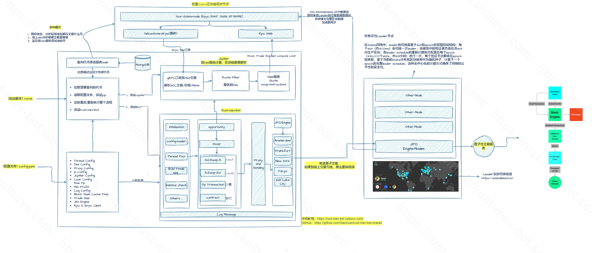

# Solana MEV 套利机器人简介

基于 Rust 开发的高性能 Solana MEV 套利机器人，支持 Jupiter 聚合器和 Jito Bundle，专注与Jito套利，性能这方面无人能敌YYDS
官网：https://www.solboxs.com/

## 🔴  [必读小白教程文档](https://rust-mev-bot.solboxs.com/)
https://rust-mev-bot.solboxs.com/
## 整体架构

## 核心优势
- 自动化套利交易
- 多jito引擎节点并行处理
- 高性能交易执行（单引擎交易整体速度<10ms）
- 实时错误监控
- 多IP支持
- 多节点支持

## 收益情况
- 当前利润：demo钱包（6台机器）每天2-5sol左右
- [Demo钱包每日利润监控](https://www.circular.bot/address/F1gnxS6Csq8pyApuogH2R6z5TqShwu3o7DMTm5WUphJ7)
- [作者钱包监控地址](https://solscan.io/account/F1gnxS6Csq8pyApuogH2R6z5TqShwu3o7DMTm5WUphJ7)
- [小费收益](https://solscan.io/account/BUp6bo7x5UG3Xq8KSrnFwGbuzFJHsJcQ5vMnb9LwR7G4)
- [用户盈利数据面板-Dune](https://dune.com/yscxy/rust-mev-bot-dashboard)

## 系统要求
### 硬件配置
- CPU：3.x GHz以上（核心数越多越好）
- 内存：2G+
- 带宽：100M+
- 系统：Ubuntu 22.04

### 推荐VPS供应商
- [Hostkey](https://hostkey.com/vps/) - 性价比之选
- [NodeStop](https://billing.nodestop.io/store/bare-metal)
- [CloudFanatic](https://cloudfanatic.net/)
- [Sauceservers](https://sauceservers.com/)
- [Teraswitch](https://teraswitch.com/)
- [Vultr](https://www.vultr.com/)
- [RackNerd](https://www.racknerd.com/)

### 推荐RPC & GRPC服务商
- [Helius](https://www.helius.dev/) - RPC/Yellowstone
- [Quicknode](https://www.quicknode.com/?via=cetipo) - RPC/Jup API
- [Shyft](https://shyft.to/) - RPC/Jup API
- [KawaiiLabs](https://discord.gg/kawaiilabs) - RPC/Jup API

## 费用说明
- 收费比例：净利润的10%
- 计算公式：(毛利润-GasFee-jito小费)*0.1
- Gas补充：建议通过[Jupiter](https://jup.ag/)兑换WSOL，定期补充

## 安全建议
- 使用独立的套利钱包
- 定期备份配置文件
- 不要在公共环境暴露私钥
- 谨慎设置交易参数

## 社区交流
- [Discord社区](https://discord.gg/rCBZy4ZKZD)
- 作者邮箱：yscxyjd@gmail.com

## 免责声明
本软件仅供学习研究使用。使用者需自行承担因使用本软件而产生的所有风险和责任。作者不对因使用本软件造成的任何损失负责。

## 相关项目
- [MEV Bot Management](https://github.com/WhiteWatson/mev-bot-management) - 用于批量部署和管理多台 Rust MEV Bot 的自动化运维工具
- [Circular Bot Scraper](https://github.com/WhiteWatson/circular-bot-scraper) - 用于自动抓取 Circular.bot 热门钱包数据的工具

## Star History

